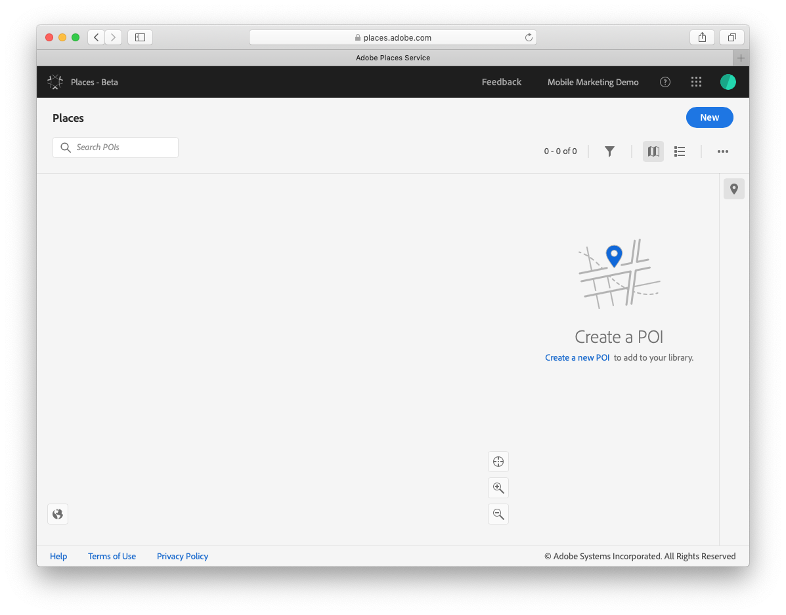
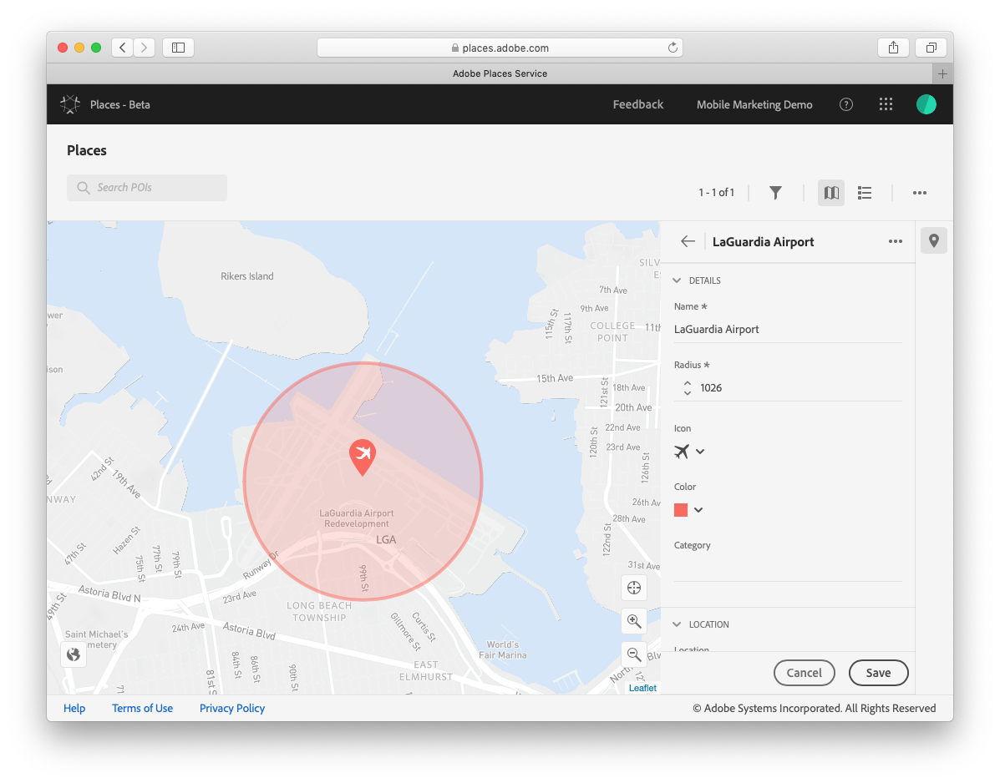
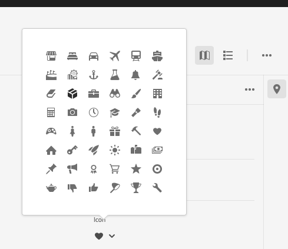
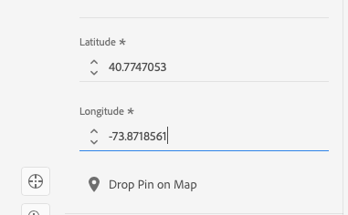
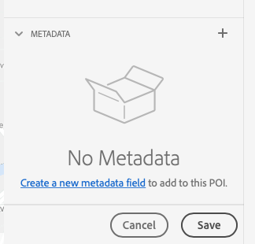

## Create Points of Interest

A point of interest \(POI\) is a location or a point on a map that is of importance to your organization or company. It can include locations like cafes, restaurants, retail locations, stadiums and so on. Companies can define points of interest to help personalize a user's mobile experience when they have entered a geo-fenced region for a particular point of interest. Beyond personalized experiences, companies may also create points of interest to help them analyze and better understand location traffic patterns. A large retail chain may choose to create POIs for all of their store locations to gain analytics on user's that have their mobile application AND visit a store location. 

### Create a new POI
1. Log in to Adobe Experience Platform Location Service with your Adobe ID.
2. In the top right side, click the **New** button. 

3. Type a name for your POI. 
   
 
4. Enter a radius for the POI (minimum distance recommended is 100m)
5. Optional

   a. Select an icon for your POI.
   
   b. Select a color for the icon. 
   
 
   
   c. Specify a category for your POI.

6. Expand the **Location** section.

   a. Type an address.

   b. Type the city.

   c. Type the name of the state.

   d. Type the name of the country.

   e. Enter the POI latitude. (required)

   f. Enter the POI longitude. (required)

   f. Click **Drop Pin on Map**. (Dropping a pin is useful if you do not know the exact latitude and longitude of a location) 
   
 

7. Expand the **Metadata** section and click **Add Metadata.** Metadata can help further define a location and can be used in other Adobe solution workflows to further refine an audience. 
   
 

     a. Type the key name.

   b. Type the key value.

8. Click **Save**.
