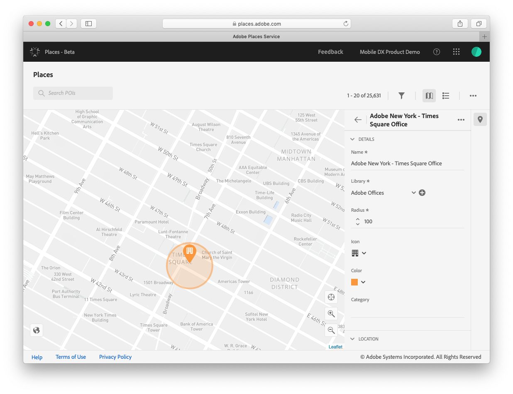
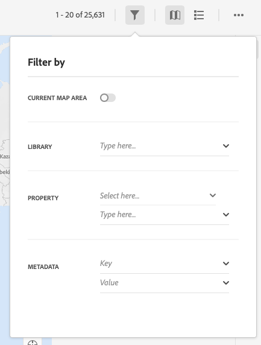

# Manage Previously Created POIs
After creating a point of interest (POI) you may wish to go back and edit the POI to add metadata values or to correct location or address information. The steps below will show how to edit or delete POIs from the Location Service. 

## Edit a POI
 
   
 
1. Log into Adobe Experience Platform Location Service using your Adobe ID.
2. The sidebar on the right side of the interface will show a listing of previously created POIs by creation date.
3. Locate the POI that you want to edit.
4. Hover over the POI and click **...** and select **View Details**.
5. Update the information and click **Save**.

## Delete a POI

1. Locate the POI that you want to delete.
2. In the top right side, hover over the POI and click the icon that looks like a bulleted list.
3. Locate the POI that you want to delete.
4. Click **...** and select **Delete**.

## Filter POIs by city, state, country, or metadata 
   
 

1. You can filter the listing of POIs in one of the following ways: 
2. By library:

   a. Select a library.

3. By property:

   a. In **Property** drop-down list, select **Country**, **State**, or **City**.

   b. In the next line, enter a value. For example, you can select **State** and type **California**.

4. With metadata:

   a. Enter a key and value.

## Defining a geofence POI

Geofences are a type of POI and are defined in the database based by the following keys:

| Keys | Description | Required? |
| :--- | :--- | :--- |
| ID | Unique identifier assigned to each POI | Yes |
| Name | Friendly Name given to the POI | Yes |
| Library | Each POI must be assigned a library for organization | Yes |
| Icon | Assist with visualizations of the POIs | Yes \(assigned default\) |
| Color | Assist with visualizations of the POIs | Yes \(assigned default\) |
| Category | Assign a common framework of categories that are common across all POIs in all libraries | No |
| Address | Street address | No |
| City | city of POI | No |
| State/Region | state or region of POI | No |
| Country | country of POI | No |
| Latitude | Latitude coordinate for center of POI | Yes |
| Longitude | Longitude coordinate for center of POI | Yes |
| Metadata | custom key + value pairs that can be assigned to POIs. This metadata streamlines future workflows by allowing you to group POIs across libraries for each to use rules and filters in downstream workflows such as send a push notification whenever someone enter a POI with Type = Competitor. | No |
