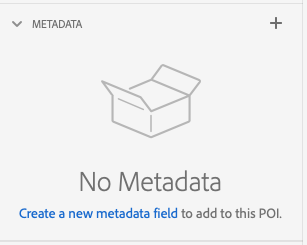
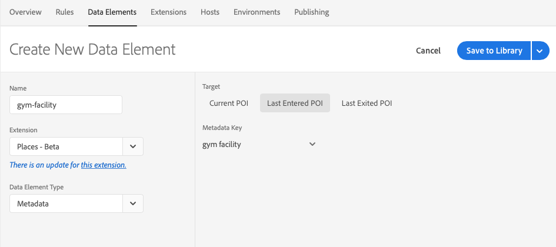
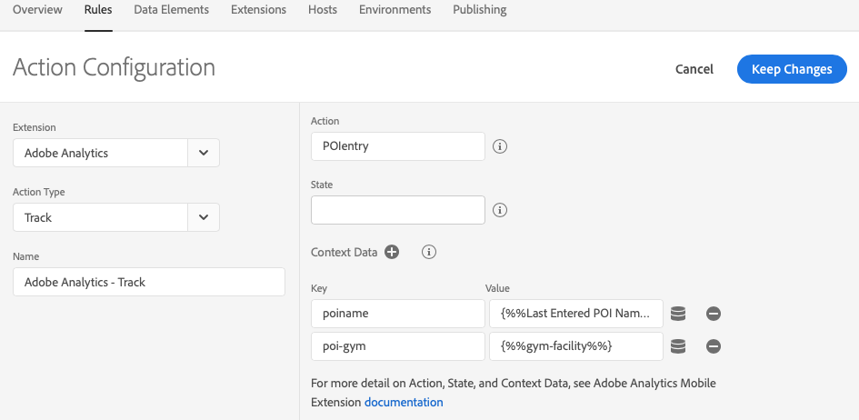
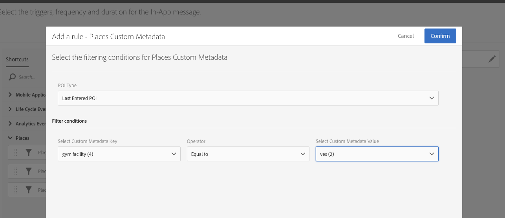

## Strategies for using metadata with POIs

When creating a new POI the only required elements are Name, Radius, Latitude and Longitude, but if only entering the minimum, an opportunity is missed in creating additional value.   
 

Point of interest metadata can be used in a variety of ways. From a POI management standpoint, adding metadata values can aid in searching for or filtering a list of potentially thousands of POIs. Creating metadata for key attributes related to a POI can yield value in downstream workflows. For instance, a hotel chain creating POIs for each property may want to include metadata such as if the hotel property has a pool or not, or a restaurant and bar, or if they have a gym facility. This metadata can be included as context data in analytics and can also be used for targeted offers or messaging. 

### Location Service metadata in Launch
In Adobe Experience Platform Launch you can create data elements for each Location Service metadata field that is important for tracking or messaging purposes.   

You can then create an action with the Analytics extension for creating a new hit that includes whatever metadata you would like as context data.  

### In-App Messaging in Adobe Campaign
Metadata can be used as a filter for local notifications and in-app messages defined in Adobe Campaign Standard. Using metadata as a filter affords the opportunity to create a more relevant message that is contextual to the actual location.   

